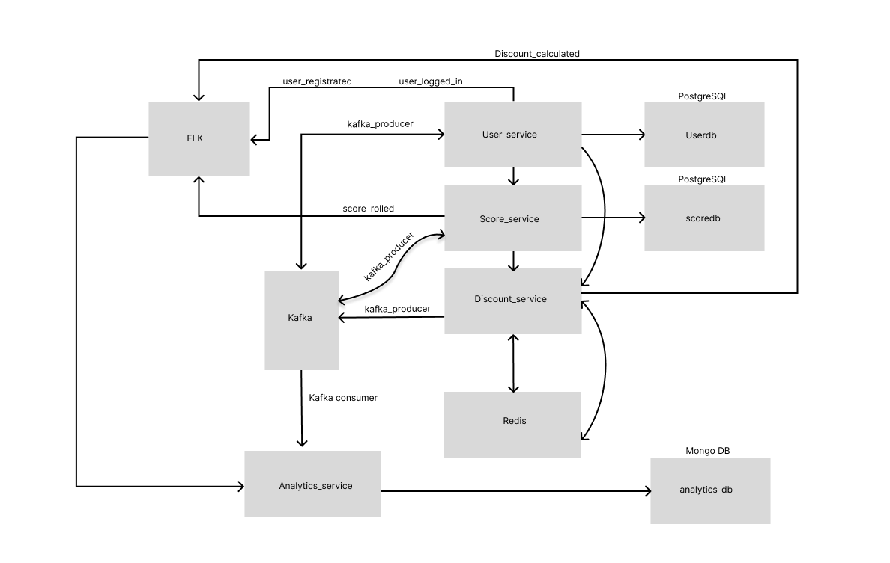

# Microservice Test Bench - Data Pipeline Experiments

This project is a **microservices-based application** created as a **learning and demonstration platform** to showcase my skills in:

- **Software testing** (manual & automated)
- **Test documentation and traceability**
- **Microservices architecture design**
- **Modern development and integration tools** (Kafka, Redis, ELK, PostgreSQL, MongoDB, Docker, Kubernetes)

It simulates a **production-like system** with multiple services, each using its own database and integrated with widely used enterprise technologies. This project demonstrates **best practices in testing, architecture, and automation**, providing a complete example of how to design, document, and validate a microservices ecosystem.

All testing documentation is available in the [Documentation](#documentation) section.
---

## Project Overview

1. **User Registration** → User Service saves to PostgreSQL → Events to Kafka & ELK
2. **User Login** → JWT authentication → Events to Kafka & ELK  
3. **Score Generation** → Score Service saves to PostgreSQL → Events to Kafka & ELK → Top 10 cached in Redis
4. **Discount Calculation** → Based on age + leaderboard → Cached in Redis → Events to Kafka & ELK
5. **Analytics** → Analytics Service consumes Kafka events → Stores in MongoDB

## Future Features

6. **Kubernetes deployment** → In progress  
7. **Automation test coverage over 50%** → In progress  
8. **GitLab CI/CD integration** → In progress  
9. **New business features**:  -> In progress
   - Add roles (admin, user, manager)  
   - Add extra spin for donation  
   - Add WebSocket chat  
   - Add **gRPC connections** for inter-service communication (planned for Score ↔ Discount ↔ Analytics services) 

---

**Key Technologies:** FastAPI, PostgreSQL, MongoDB, Redis, Kafka, ELK Stack, Docker


## Architecture



## Quick Start

### Prerequisites
- Docker Desktop
- Git

### 1. Clone Repository
```bash
git clone https://github.com/GGWPVV/microservice-test-bench.git
```

### 2. Start All Services
```bash
docker-compose up -d
```

### 3. Access Services
- **APIs**: http://localhost:8000/docs (User), http://localhost:8003/docs (Score), http://localhost:8002/docs (Discount)
- **Kafka UI**: http://localhost:9000
- **Kibana**: http://localhost:5601

##  Monitoring

- **Logs**: Kibana (http://localhost:5601)
- **Events**: Kafdrop (http://localhost:9000)
- **Health**: `/health` endpoints on all services

##  Testing

```bash
cd tests/
pytest user_service/unit_tests/
pytest score_service/integration_tests/
```

See [docs/test_strategy.md](docs/test_strategy.md) for details.

##  Documentation

- [Requirements Specification](docs/requirements.md)
- [API Documentation](http://localhost:8000/docs) (when running)
- [Test Strategy](docs/test_strategy.md)
- [Test Documentation](tests)
- [Requirements Traceability Matrix](https://www.notion.so/25e317ee517d806fb731c16fb6f0ac5d?v=25e317ee517d80f8a008000c4f15e1a6&source=copy_link)
- [Tests examples from TMS Qase](./tests/Tests%20from%20Qase%20TMS/)
##  License

This project is for educational and demonstration purposes.

---

**Built with for learning microservices architecture**